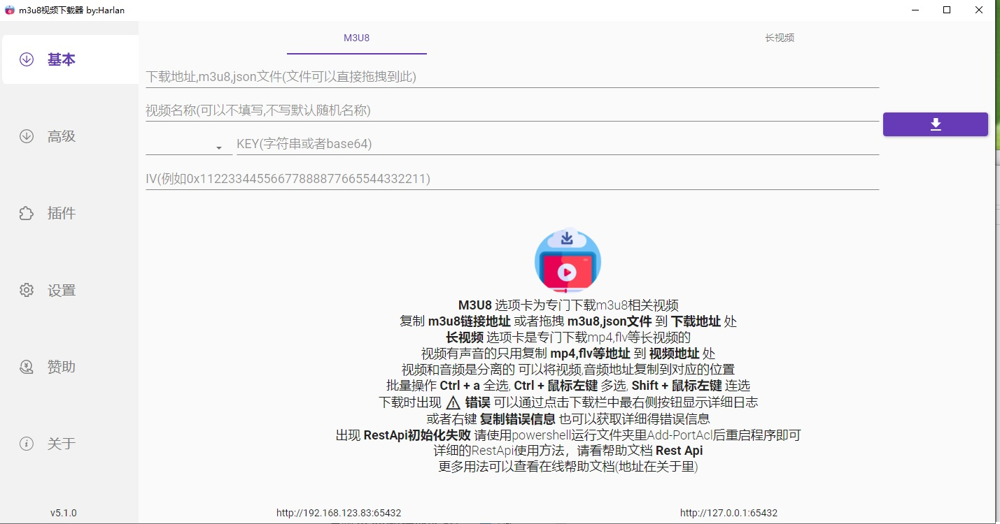
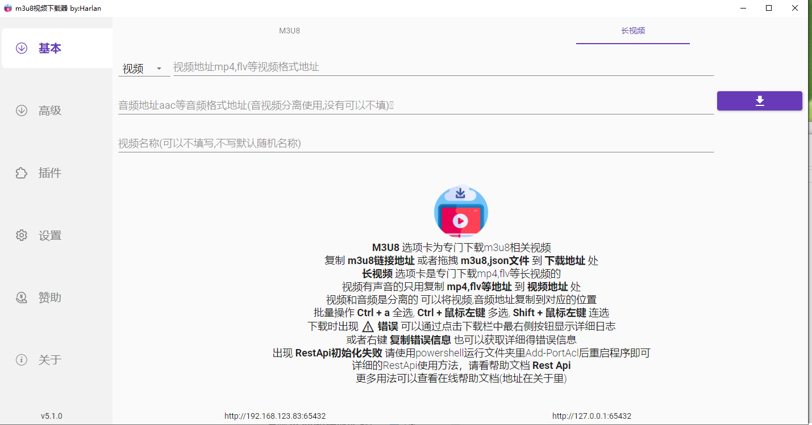
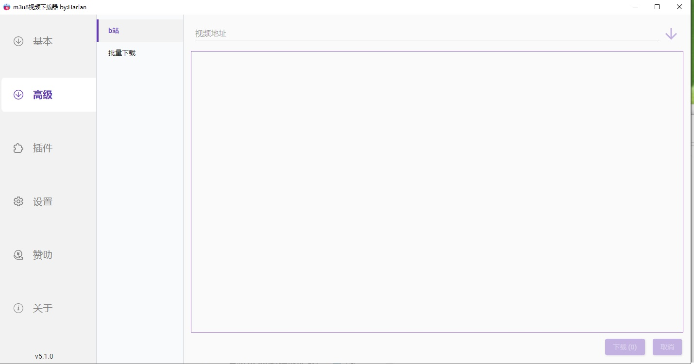
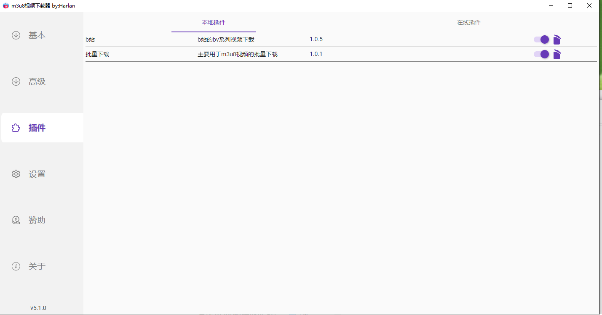
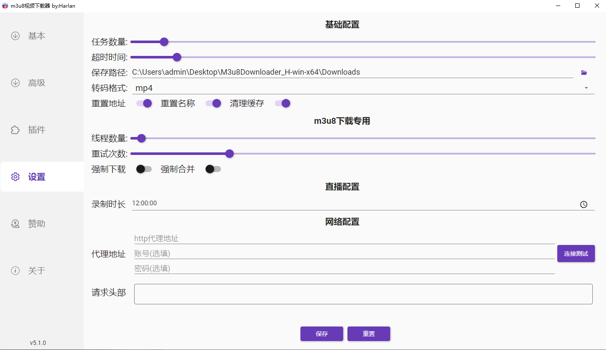

# M3u8Downloader_H
  - [简介](#简介)
  - [特点](#特点)
  - [插件项目地址](#插件项目地址)
  - [帮助文档](#帮助文档)
  - [软件截图](#截图)
  - [支持作者](#支持作者)
 
## 简介
- 此项目插件功能初步完成，后续可能是继续优化插件相关体验，及主程序的功能扩展。

## 特点
 - 支持多线程，多任务,断点续传
 - 支持aes-128-cbc,aes-192-cbc,aes-256-cbc自动解密
 - 支持对m3u8的ts,fmp4格式下载
 - 支持批量下载功能
 - 支持代理，在设置中配置
 - 自动转换png,jpg,bmp等伪装格式的ts流
 - 自动识别直播流，同时下载直播流
 - 可以自定义请求头
 - 个性化的m3u8下载，可以采用json等方式下载m3u8的文件内容
 - 提供http接口调用，可以使用任何语言对软件发起调用下载，具体参见帮助文档
 - 提供插件功能，可以个性化定制自己的下载需求，具体参见帮助文档->插件开发

## 插件项目地址
 - https://github.com/Harlan-H/M3u8Downloader_H.Plugins

## 帮助文档
 - wiki : https://github.com/Harlan-H/M3u8Downloader_H/wiki/

## 截图

## 支持作者
|微信|支付宝|
|:--:|:--:|
|||
